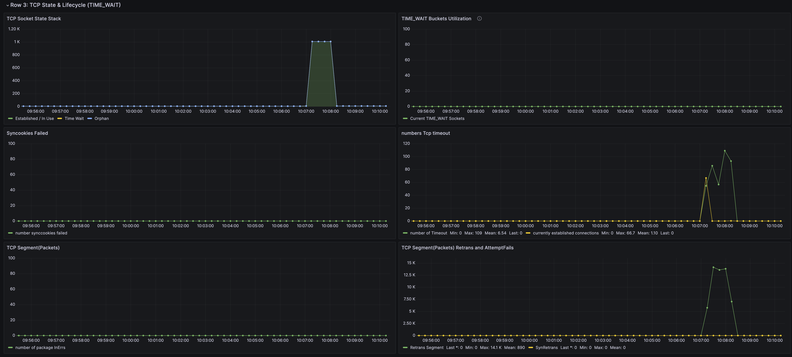
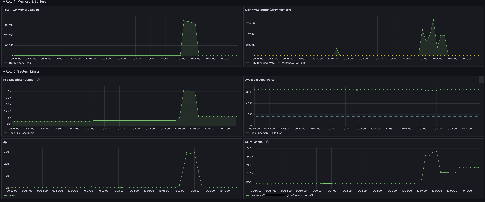
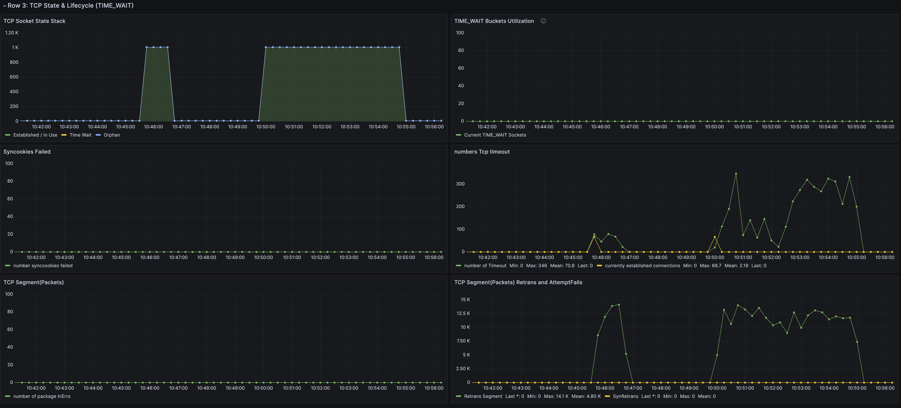
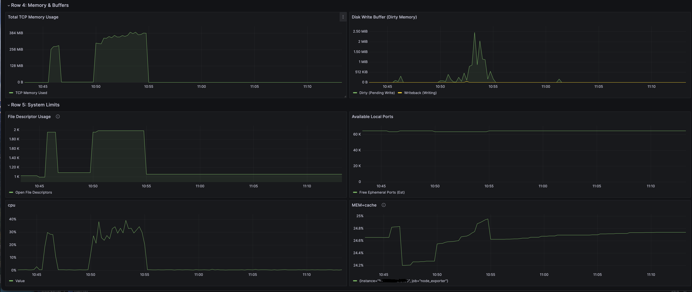

# Setup lab
```
rocky-01: this server transmitted
rocky-02: this server recvied
rocky-03: this server collect metrics and display thourgh grafana
```

optional to this test, just run quick manual apply
```
sudo sysctl -w net.core.somaxconn=65535
sudo sysctl -w net.ipv4.tcp_max_syn_backlog=65535
sudo sysctl -w net.core.netdev_max_backlog=65535
sudo sysctl -w net.core.rmem_max=16777216
sudo sysctl -w net.core.wmem_max=16777216
sudo sysctl -w net.core.rmem_default=1048576
sudo sysctl -w net.core.wmem_default=1048576
sudo sysctl -w net.core.optmem_max=65535
sudo sysctl -w net.ipv4.tcp_rmem="4096 1048576 16777216"
sudo sysctl -w net.ipv4.tcp_wmem="4096 1048576 16777216"
sudo sysctl -w net.ipv4.tcp_slow_start_after_idle=0
sudo sysctl -w net.ipv4.tcp_fin_timeout=15
sudo sysctl -w net.ipv4.tcp_keepalive_time=300
sudo sysctl -w net.ipv4.tcp_keepalive_intvl=30
sudo sysctl -w net.ipv4.tcp_keepalive_probes=5
sudo sysctl -w net.ipv4.tcp_max_tw_buckets=1440000
sudo sysctl -w net.ipv4.tcp_syncookies=1
sudo sysctl -w net.ipv4.tcp_timestamps=1
sudo sysctl -w net.ipv4.tcp_sack=1
sudo sysctl -w net.ipv4.tcp_window_scaling=1
sudo sysctl -w net.ipv4.ip_local_port_range="1024 65535"
sudo sysctl -w net.ipv4.ip_forward=1
sudo sysctl -w fs.file-max=2097152
sudo sysctl -w fs.nr_open=2097152
sudo sysctl -w vm.dirty_ratio=20
sudo sysctl -w vm.dirty_background_ratio=10
sudo sysctl -w vm.overcommit_memory=1
sudo sysctl -w kernel.pid_max=4194304
sudo sysctl -w kernel.threads-max=4194304
```

After apply sysctl just running script install nginx server `bash nginx/install-nginx.sh` <br>
Create file 100kb and 1MB for nginx testing
```
# Create 100KB test file in nginx web root
dd if=/dev/zero of=/var/www/html/100KB.bin bs=100K count=1

# Create 1MB test file in nginx web root
dd if=/dev/zero of=/var/www/html/100MB.bin bs=1M count=1
```
After that install `wrk` on server transmitted <br>

we will test with those commands below
```
wrk -t4 -c1000 -d60s --timeout 10s http://<ip-server>/500KB.bin
wrk -t4 -c1000 -d60s --timeout 10s http://<ip-server>/1MB.bin
```

## Test with 1k connection - 500KB (1 min)
So prepare for this benchmark we draw grafana dashboard show all values we need monitor. This chart in this

### Result running test
``` 
Running 1m test @ http://<ip-server>/500KB.bin
  4 threads and 1000 connections
  Thread Stats   Avg      Stdev     Max   +/- Stdev
    Latency     2.83s   777.23ms   8.46s    81.77%
    Req/Sec    86.43     38.41   580.00     77.74%
  20572 requests in 1.00m, 10.05GB read
Requests/sec:    342.42
Transfer/sec:    171.33MB
```
 <br>
 <br>
So with 500kb it easy pass. Some analyst [this chart](grafana/dashboard.json)

| Time     |  TCP Memory   | File Descriptors | Retransmits | Timeouts |
|:---------|:-------------:|-----------------:|------------:|---------:|
| 10:07:00 | 5 MB → 192 MB |      750 → 2,000 |     0 → 13K |  0 → 110 |
| 10:08:00 | 192 MB → 5 MB |      2,000 → 750 |     13K → 0 |  110 → 0 |

- 110 timeouts out of 20,572 requests = 0.53% timeout rate
- Most likely connection establishment timeouts, not transfer timeouts
- May indicate initial SYN backlog overflow during connection ramp-up
- 10-second timeout threshold in wrk config caught slow handshake

## Test with 1k connection - 1MB (5 mins)
So when CDN working chunks file split range 1-50mb therefore we will test with 1mb (limit by hardware :( )

```
Running 5m test @ http://<ip-server>/1MB.bin
  4 threads and 1000 connections
  Thread Stats   Avg      Stdev     Max   +/- Stdev
    Latency     2.30s     2.68s   10.00s    80.34%
    Req/Sec   145.20    156.23     0.95k    83.30%
  170602 requests in 5.00m, 167.13GB read
  Socket errors: connect 0, read 0, write 0, timeout 3782
Requests/sec:    568.49
Transfer/sec:    570.29MB
```

 <br>
 <br>

```
TCP's retransmission mechanism is compensating:
├─ Packet lost → TCP detects → Retransmits
├─ Eventually succeeds (97.8% of time)
├─ Only 2.2% give up after max retries
└─ System keeps chugging despite ring buffer limitation
```

**Timeout Root Cause (3,782 failures):** <br>
***NIC Ring Buffer Overflow:*** The primary culprit 
- Default ring buffer size (typically 256-512 slots) insufficient
- At 1,000 concurrent connections × 1MB payloads = massive packet burst
- When ring buffer full → packets dropped → TCP retransmits → timeout if max retries exceeded

***SYN Backlog Overflow:*** Possible during initial connection surge
- `net.ipv4.tcp_max_syn_backlog=65535` may still overflow briefly

**Issue about ring buffer (we cant increase because hitting limit hardware)** <br>

**Expected impact of ring buffer increase:**
- Reduce packet drops from burst traffic
- Lower retransmission rate significantly
- Decrease timeout errors (possibly from 2.2% to <0.5%)
- Smoother throughput without micro-bursts


### Result:
- Kernel tuning is working correctly
- Problem is upstream of TCP layer (NIC ring buffers)
- Current sysctl parameters are appropriate; don't increase further
- Focus optimization on hardware layer (NIC) not kernel layer

### Command use:
```  
# watch network
watch -n 1 'ss -s && echo "---" && netstat -s | grep -E "overflow|drop" | head -5'

# watch cpu
mpstat -P ALL 1

# watch network drops
watch -n1 'echo "=== Packet Drops ==="; ethtool -S eth0 | grep drop; echo "=== SYN Overflows ==="; netstat -s | grep overflowed'

# check network eth
ethtool -g eth0
```

# Resource links
- **Extreme HTTP Performance Tuning: 1.2M API req/s on a 4 vCPU EC2 Instance**  
  https://talawah.io/blog/extreme-http-performance-tuning-one-point-two-million/  
  Real-world case study achieving 1.2M requests/second with kernel tuning
- **Low Latency Tuning Guide**  
  https://rigtorp.se/low-latency-guide/  
  Comprehensive guide for low-latency network optimization
- **Monitoring and Tuning the Linux Networking Stack: Sending Data**  
  https://blog.packagecloud.io/monitoring-tuning-linux-networking-stack-sending-data/  
  Deep dive into Linux network stack internals and tuning
- **RHEL 9: Network Performance Tuning**  
  https://docs.redhat.com/en/documentation/red_hat_enterprise_linux/9/html/monitoring_and_managing_system_status_and_performance/tuning-the-network-performance_monitoring-and-managing-system-status-and-performance  
  Official Red Hat documentation on network tuning (ring buffers, etc.)
- **Linux Advanced Routing & Traffic Control**  
  https://tldp.org/HOWTO/Adv-Routing-HOWTO/lartc.kernel.obscure.html  
  Advanced kernel networking parameters explained
- **Recent Linux TCP Updates: 100G Host Tuning**  
  https://scinet.supercomputing.org/community/documents/36/sc16-techtalk01-100G-Tuning-INDIS.tierney.pdf  
  Tuning guide for 100 Gbps networks
- **100G Tuning (fasterdata.es.net)**  
  https://fasterdata.es.net/host-tuning/linux/100g-tuning/  
  ESnet's guide for high-speed network tuning
- **Google Cloud: Tuning Linux TCP for Data-Center Networks**  
  https://lpc.events/event/16/contributions/1343/attachments/1027/1972/Tuning%20Linux%20TCP%20for%20data-center%20networks%20(3).pdf  
  Google's approach to TCP tuning in data centers
- **Intel 10Gb x520-da2 Performance Tuning for Linux**  
  https://glenewhittenberg.blogspot.com/2016/03/intel-x520-da2-performance-tuning-for.html  
  Intel NIC specific optimizations and ixgbe driver tuning
- **Performance Tuning Guidelines for Mellanox Network Adapters**  
  https://ebooks.hgs.name/Performance_Tuning_Guide_for_Mellanox_Network_Adapters.pdf  
  Comprehensive Mellanox NIC tuning guide
- **How to Tune Your Linux Server Using mlnx_tune Tool**  
  https://enterprise-support.nvidia.com/s/article/How-to-Tune-Your-Linux-Server-for-Best-Performance-Using-the-mlnx-tune-Tool  
  NVIDIA's automated tuning tool for Mellanox NICs
- **Understanding NUMA Node for Performance Benchmarks**  
  https://enterprise-support.nvidia.com/s/article/understanding-numa-node-for-performance-benchmarks  
  NUMA optimization for network performance
- **DPDK Mellanox NIC Performance Report**  
  https://fast.dpdk.org/doc/perf/DPDK_21_11_Mellanox_NIC_performance_report.pdf  
  DPDK performance benchmarks for kernel bypass
- **Maximizing TCP Throughput in Linux: Understanding Send and Receive Buffers**  
  https://madflojo.medium.com/maximizing-tcp-throughput-in-linux-understanding-and-tuning-send-and-receive-buffers-92df654c415f  
  TCP buffer sizing explained with examples
- **Account for the Bandwidth-Delay Product with Larger Network Buffers**  
  https://lonesysadmin.net/2013/12/19/account-bandwidth-delay-product-larger-network-buffers/  
  Bandwidth-delay product calculations for buffer sizing
- **Tune TCP (Cromwell International)**  
  https://cromwell-intl.com/open-source/performance-tuning/tcp.html  
  TCP window sizing and tuning parameters
- **Bandwidth-Delay Product**  
  https://en.wikipedia.org/wiki/Bandwidth-delay_product  
  Wikipedia explanation of BDP concept
- **Sysctl Configuration for High Performance Servers**  
  https://www.golinuxcloud.com/sysctl-config-for-high-performance-servers/  
  Comprehensive sysctl parameters for performance
- **A Guide to Tuning Kernel Parameters with sysctl in Linux**  
  https://www.enginyring.com/en/blog/a-guide-to-tuning-kernel-parameters-with-sysctl-in-linux  
  Kernel parameter tuning guide
- **What Exactly Does Kernel Parameters Do?**  
  https://community.unix.com/t/what-exactly-does-kernel-parameters-do/330689  
  Explanation of kernel parameters and their effects
- **Network Performance Monitoring**  
  https://www.opensourceforu.com/2016/10/network-performance-monitoring/  
  Tools and techniques for network monitoring
- **How to Passively Monitor for TCP Packet Loss (Linux)**  
  https://serverfault.com/questions/318909/how-passively-monitor-for-tcp-packet-loss-linux  
  TCP packet loss monitoring techniques
- **Troubleshooting SYNs to LISTEN Sockets Dropped**  
  http://www.linux-admins.net/2020/08/troubleshooting-syns-to-listen-sockets.html  
  Debugging SYN queue overflows
- **LVS: Performance and Kernel Tuning**  
  https://docs.huihoo.com/hpc-cluster/linux-virtual-server/HOWTO/LVS-HOWTO.performance.html  
  Linux Virtual Server performance optimization
- **TCP Congestion Control Tuning**
  https://lowendtalk.com/discussion/184195/linux-network-performance-tuning  
  Discussion on TCP congestion control algorithms (Cubic, BBR, etc.)
- **Linux Tuning For SIP Routers – Part 4 (Networking)**  
  https://voipmagazine.wordpress.com/2014/12/29/linux-tuning-for-sip-routers-part-4-networking/  
  Networking tuning for high packet rate scenarios
- **Linux Network Performance Optimization Tips**  
  https://nixsanctuary.com/linux-network-performance-optimization-tips-for-optimizing-linux-network-throughput-and-latency/  
  General network optimization tips
- **CERN: ALICE Network Workshop**  
  https://indico.cern.ch/event/274974/contributions/620868/attachments/497313/687046/RV_Network_ALICE_WKS_20140307_v0.pdf  
  High-performance computing network optimization
- **cherusk.github.io: Linux TCP Window Scaling Quantification**  
  https://cherusk.github.io/linux-tcp-window-scaling-quantification-rmemwmem.html  
  Deep dive into TCP window scaling and buffer sizing
- **cherusk.github.io: Monitoring and Tuning Linux Networking Stack Egress (TX)**  
  https://cherusk.github.io/monitoring-and-tuning-the-linux-networking-stack-egress-tx.html  
  Transmit path optimization in Linux networking stack
- **Performance Tuning for Linux Servers**  
  https://dokumen.pub/performance-tuning-for-linux-servers-013144753x-9780131447530.html  
  Complete book on Linux server performance tuning
- **Atlantic Linux: Performance Tuning Training**  
  https://atlanticlinux.ie/training/performance-tuning/slides-with-notes.pdf  
  Training slides on performance tuning
- **Flashcards: Study Materials**  
  https://flashcards.world/flashcards/sets/a2986fc9-ed31-4456-8e88-6d001128e5c6/  
  Study materials for network performance concepts
